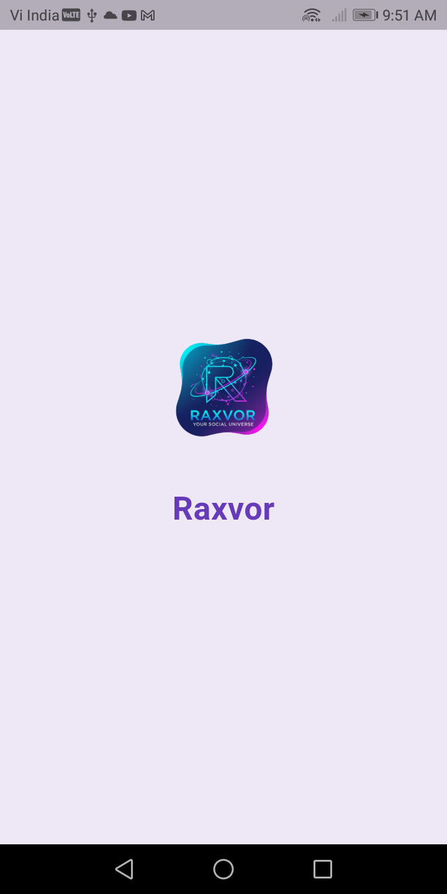
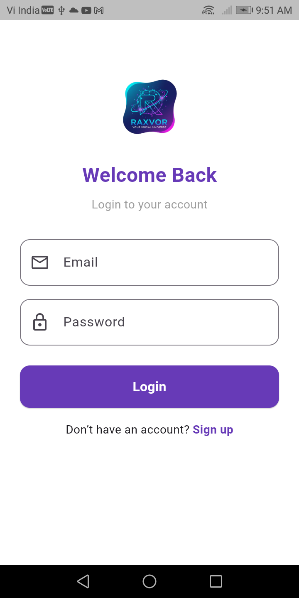
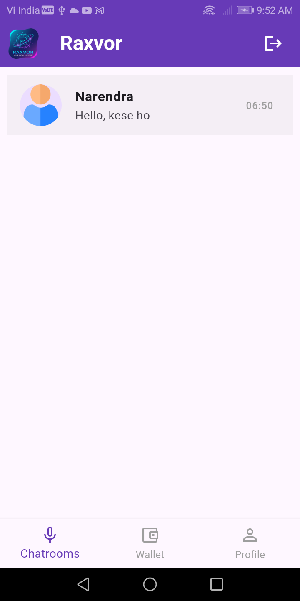
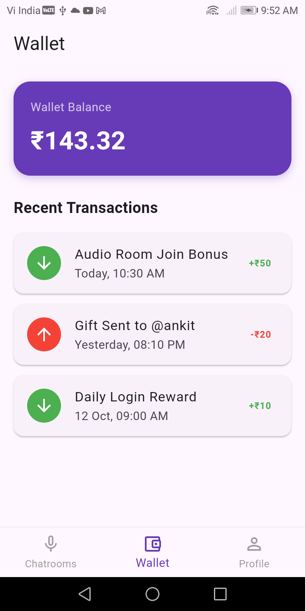
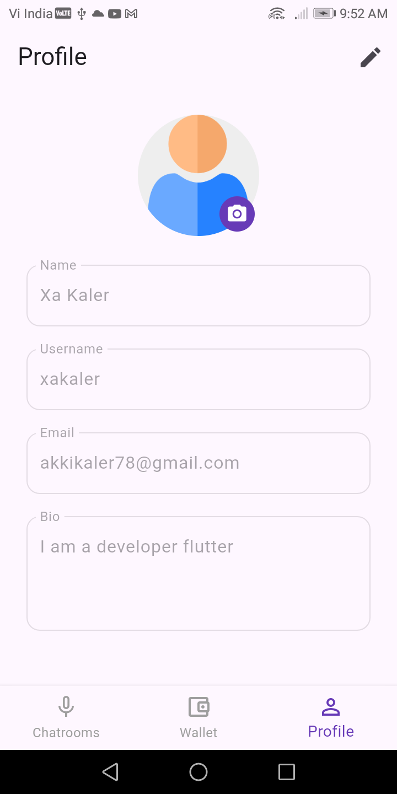
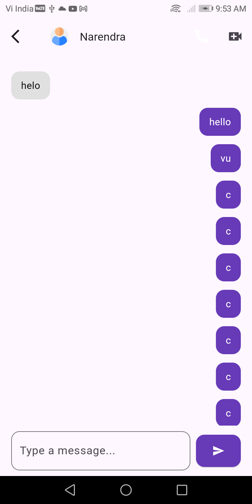

# 📱 Raxvor - Social Chat & Calling App

**Raxvor** is a real-time chat and calling application with features similar to WhatsApp.  
It supports **text chat, audio calls, and video calls**, making it perfect for personal or small-group communication.

---

## 📷 Screenshots

| Splash Screen | Login Screen | Home | Wallet | Chat | Call |
|------------|------------|------------|------------|---------------|----------------|
|  |  |  |  |  |  |

## 🚀 Key Features

### 🔑 Authentication
- Users can **sign up / log in** with email and password.  
- Firebase Auth handles authentication securely.  

### 🏠 Home Screen
- Displays **list of users** available for chat or calls.  
- Users can **select a contact** to start a chat, audio call, or video call.  

### 💬 Chat
- Real-time text messaging between users.  
- Message history stored in **Supabase**.  
- Supports emoji and message timestamps.  

### 📞 Audio & Video Calling
- High-quality **audio and video calls** powered by **Agora SDK**.  
- One-to-one call functionality.  

### 👤 Profile Screen
- Users can view and update their profile.  
- Profile includes **username, email, and profile picture**.  

### 💰 Wallet Screen
- Users can view **wallet balance** (optional for future in-app purchases or credits).  
- Simple, clean interface to display wallet status.  

---

## 🧰 Tech Stack

| Layer | Technology |
|-------|------------|
| **Frontend** | Flutter |
| **Backend / Database** | Supabase (user & chat data) |
| **Authentication** | Firebase Auth |
| **Realtime & Notifications** | Firebase Realtime Database / FCM |
| **Audio/Video Calls** | Agora SDK |
| **Hosting / Deployment** | Supabase / Firebase |

---

# Run the app
flutter run
